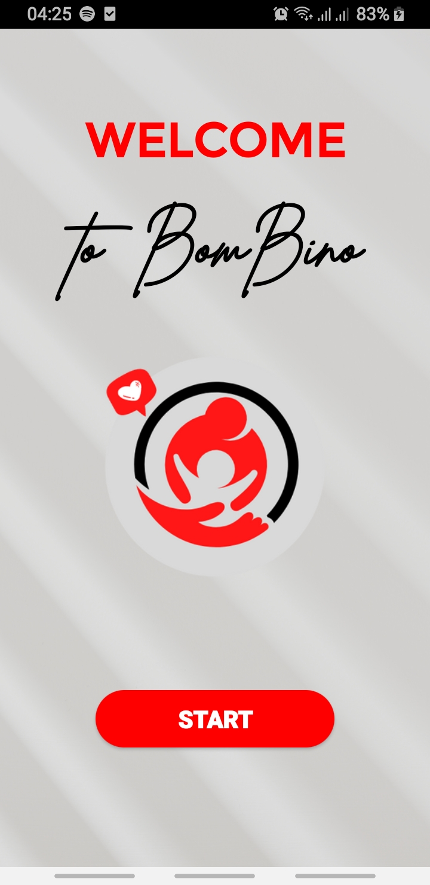

# Android_Child_Care

Ce projet traite spécialement de la prise en charge adéquate des enfants. Ce projet propose différentes manières et moyens de prendre soin de leurs enfants.
Cette application comportera également une section où les parents pourront émettre leurs doutes et obtenir des conseils d'experts. Cette application va les aider à
prendre soin de leurs enfants vieillissant de quelquesjours à 10 ans.

L'utilisateur serait des parents ayant des enfants jusqu'à l'âge de 10 ans. Ils auraient besoin de s'inscrire sur l'application. Et ils peuvent sélectionner la plage pour leurs enfants comme 0
mois à 1 an, 1 an à 3 ans, 4 ans à 7 ans et de 8 à 10. Ce sera le même ordre dans lequel les utilisateurs recevront des conseils pour leurs enfants. Donc cette application vous informe sur
la vaccination alimentaire sommeil de votre enfant selon son âge

Pour créer cette application, vous devez utiliser Android Studio IDE pour que la plate-forme construise ce projet. Ensuite, la programmation peut être effectuée en Java et l'interface
utilisateur peut être développée en utilisant XML.

# Interface de l'application BamBino :

